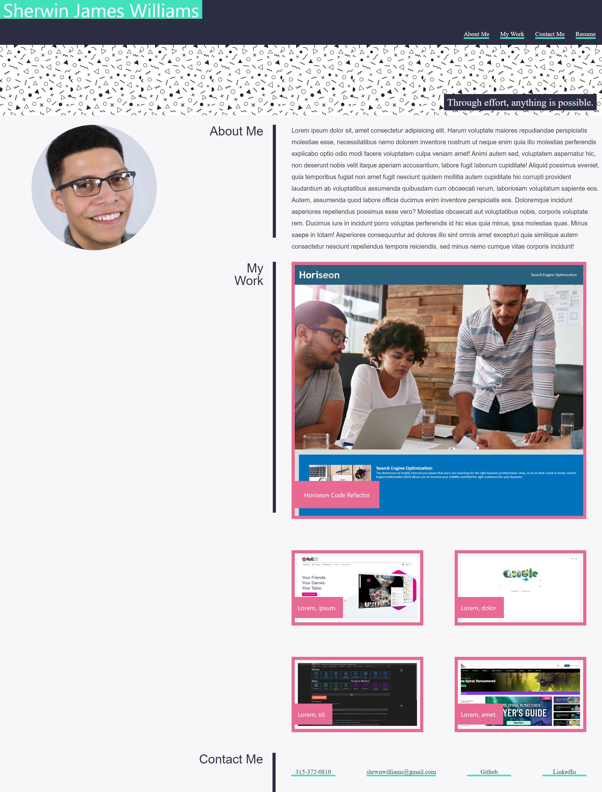

# Decription
This is the next iteration of my portfolio website. I have updated the styling using CSS and went for a more streamlined, simplified design and updated the "My Work" section with my first project and some of my homework assignments. Prospective employers can easily navigate the page on desktop or mobile devices. They will be able to:
- Learn about me by reading the "About Me" section
- See examples of my work with the links provided
- Easily access both my resume and several forms of contact

# Deployed Site
Here is the link to the deployed site.

[Deployed Site](https://shrwnwilliams.github.io/sherwin-williams-portfolio/)